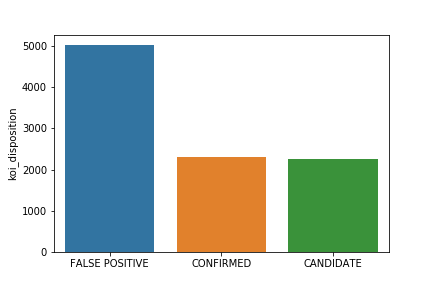
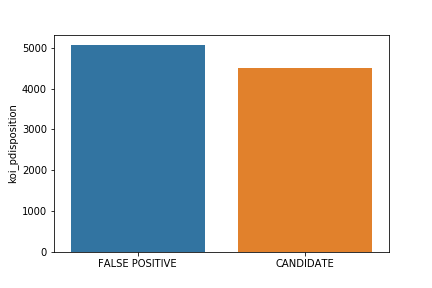
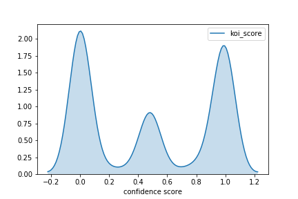
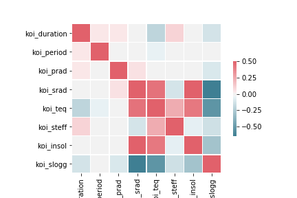
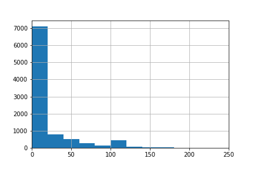
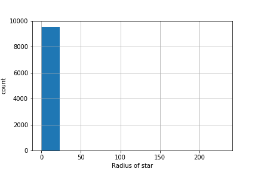
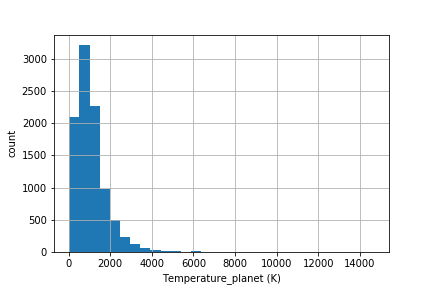
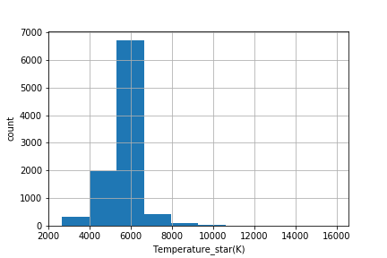

# Kepler Exoplanet Analysis
The data for this project has been acquired from Kaggle competitions (https://www.kaggle.com/nasa/kepler-exoplanet-search-results) which specifies the objects and their characterstics as perceived by the Kepler space telescope whether the objects are exoplanets or not. The data contains a list of objects, a list of confidence scores which tell the confidence level of an object for being a potential candidate or a false positive, a list containing period of transits, duration of observation, and intrinsic properties of the parent star and the object orbiting around.

## Code and resources
**Python version** : 3.7.6  
**Packages used** : pandas, missingno, scikit-learn, seaborn  
**Reference** : https://exoplanetarchive.ipac.caltech.edu/docs/API_kepcandidate_columns.html  
                https://www.youtube.com/channel/UCiT9RITQ9PW6BhXK0y2jaeg  
## Steps
1. Looked out for the missing values in the raw data.
2. Dropped the columns that were not necessary in the analysis.
3. Dropped the objects in the data frame momentarily to replace the missing values with the average of the respective columns using simple imputer.
4. Concatenated the object columns that were dropped earlier.
5. Created a cleaned data file.
6. Exploratory data analysis.

## Plots
The plots below show the number of false positive, candidates and confirmed objects in literature (1st plot) and using observations (2nd plot).  
   
The confidence score plot below shows that there is a very low confidence for an object being a false positive, which means that most of the objects should probably be planets.  
  
The heat map shows the correlation of certain columns and how can these columns be used to derive some characteristics of the planets (for example - positive correlation between star temperature and temperature of the planet).  
  
The distribution of the radii of the planets (in Earth radii) falls mostly between 0 and 25. There are very few planets that are couple hundred times larger. The size of the parent stars fall between 0 and 25 (almost all).  
   
The equilibrium temperature of the planets show some sort of normal distribution most of which fall between 0 to 2000 kelvins. The effective temperature of the parent star mainly falls approximately between 4000 to 8000 kelvins.  
   

## Model building
For building the model, I chose the necessary columns that would be used to get score predictions and created dummy variables using these columns. Then I splitted the data into training data and test data with test size of 50%. Since mean absolute error (MAE) gives the insight to what estimator to use, I tried three different models:  
* **Multiple linear regression** - uses several explanatory variables to predict the outcome of a response variable.  
* **Lasso regression** - uses shrinkage. Shrinkage is where data values are shrunk towards a central point, like the mean.  
* **Random forest** - operates by constructing several decision trees during training time and outputting the mean of the classes as the prediction of all the trees.  
